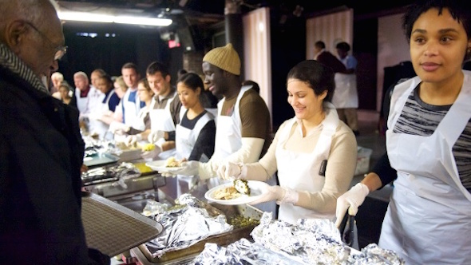

## Donating knowledge instead of money

The food bank of New York serves millions of meals per year. Without donations from various companies this would not be possible. Unlike the other companies, however, Toyota does not donate money, but its knowledge about Kaizen. With this, the waiting time for a meal was reduced from 90 to 18 minutes.

## Not accepting the status quo

Today I found this [piece about kaizen and the NYC food bank](http://www.nytimes.com/2013/07/27/nyregion/in-lieu-of-money-toyota-donates-efficiency-to-new-york-charity.html?_r=0). It shows well how important it is not to accept the status quo and to be alert for opportunities to improve.

## The problem: a long wait for a meal

The first problem Toyota was allowed to work on was the waiting time for a meal. People had to wait 1.5 hours before they could take a seat and have a meal. In the system that was used, people were served a meal in groups of 10. After all 50 seats were occupied, long queues arose, all the way outside.

## The solution

The Toyota engineers immediately abolished the system based on groups. As soon as a chair becomes available, someone from the queue may take a seat. In addition, the distance between the queue and the buffet was shortened. Someone was also appointed to direct people to the empty chairs. As a result, people get their food faster and are seated faster. All in all, this reduced the waiting time by 70 minutes!

## Kaizen in Scrum

Within Scrum, the improvement process is catalysed by the retrospective ritual:

> The retrospective is the time when members of the Team have the opportunity to inspect and adapt their process. The Team members sit down and talk about what went right, what could have gone better, and what can be made better in the next Sprint. The goal is to discover the one improvement, or Kaizen, in their own process that they, as a Team, can implement right away.
>
> If the team is able to consistently have strong Retrospectives, and produce relevant process improvement that build Sprint-to-Sprint, it will continuously improve.