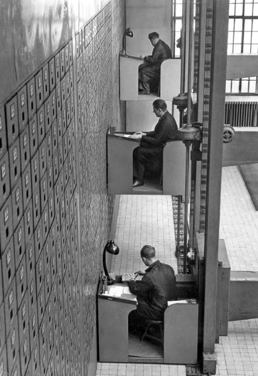

## What Does “Kafkaesque” Mean?

The term *Kafkaesque* comes from the work of Franz Kafka (1883–1924), the Czech writer best known for novels such as *The Trial* and *The Castle*. Kafka's protagonists find themselves trapped inside vast systems governed by rules they do not understand, decisions they cannot influence, and authorities they cannot meaningfully reach.

In *The Trial*, a man is arrested without being told what crime he has committed and spends the rest of the story trying to navigate an incomprehensible legal system. In *The Castle*, a surveyor attempts to gain access to the authorities who govern a village, only to encounter endless procedures, conflicting instructions, and decision makers that remain perpetually out of reach.

What makes these stories unsettling is that nobody appears intentionally malicious. The system itself becomes the problem. People follow procedures, forms are completed, approvals are requested, and decisions are escalated, yet meaningful progress becomes increasingly difficult. Responsibility seems to exist everywhere and nowhere at the same time.

A situation becomes *Kafkaesque* when people are confronted with bureaucracy that appears rational on the surface but feels absurd in practice. Rules exist, but their purpose is unclear. Decisions are made, but ownership is invisible. Authority exists, but cannot be reached. Employees spend more time navigating the system than solving the problem the system was created to address.

This may sound like fiction, but anyone who has worked in a sufficiently large organisation has probably experienced a small Kafkaesque moment.

## When Large Organisations Become Kafkaesque

> “Nobody deliberately designs a Kafkaesque organisation. It develops one reasonable decision at a time.”

A control is introduced after an incident. An approval is added to manage risk. A reporting line is created to improve oversight. A temporary workaround becomes a permanent process. Years later, employees must navigate a maze of rules whose original purpose nobody can explain.

One of the most frustrating aspects is that information itself becomes difficult to find. Documentation is outdated. Process descriptions point to old systems. Ownership changed years ago. The person who originally designed the process has moved to another department, left the company, or simply cannot be identified anymore.

Employees find themselves asking questions such as:

- Why does this approval exist?
- Who owns this process?
- Who can make an exception?
- Why are we doing it this way?
- Where is the documentation?

Surprisingly often, nobody knows.

The organisation continues to operate, but institutional knowledge slowly disappears. The process remains while the rationale behind it is lost.

The cost is greater than inefficiency. It appears as waiting time, repeated alignment, duplicated work, abandoned improvements, frustration, and eventually burnout. Research on dysfunctional bureaucracies highlights exactly these effects: inefficiency, stress, suffering and burnout. The real danger is that talented people stop trying to improve things because experience has taught them that the organisation is too difficult to influence.

## The Hidden Tax on Employees

> Most employees can cope with complexity. What they struggle with is powerlessness.

People generally accept difficult work when they understand the goal, can identify decision makers, and have a realistic path towards progress. What drains energy is repeatedly encountering barriers with no clear owner and no obvious way forward.

After enough of these experiences, employees start asking themselves the wrong questions:

- Maybe I am missing something.
- Maybe everyone else understands this process.
- Maybe I should stop pushing for improvement.

> In a healthy organisation, problems are challenging. In a Kafkaesque organisation, problems become mysterious.

## The Most Important Defense: The Engineering Manager

When people discuss bureaucratic organisations, they often focus on senior leadership. Yet employees rarely interact with executives. They interact with their Engineering Manager, Team Lead, or Chapter Lead.

That makes lower-echelon management the organisation's shock absorber.

An Engineering Manager cannot eliminate every governance process, approval chain, or organisational dependency. What they can do is prevent the team from carrying the full burden of those inefficiencies.

> Their role is not merely to deliver software. Their role is to create clarity where the organisation creates confusion.

## 1. Translate the Organisation

One of the first signs of a Kafkaesque environment is that people no longer understand why things happen.

An approval is required but nobody knows why. A project depends on another department, but nobody knows who owns the relationship. A process exists, but the reason for its existence has long been forgotten.

A good Engineering Manager becomes a translator.

Instead of saying:

> “That's just the process.”

They investigate and explain:

> “This process exists because of a regulatory requirement. This approval comes from a risk decision made several years ago. Let me help navigate it.”

Even when the process itself cannot be changed immediately, context reduces frustration.

## 2. Make Invisible Ownership Visible

One recurring characteristic of large organisations is that ownership becomes difficult to discover.

Processes survive reorganisations. Teams are renamed. Responsibilities move. Documentation lags behind reality.

Eventually no one is entirely sure who owns what.

Good managers actively maintain a map of the organisation.

They know:

- Who makes decisions.
- Who influences decisions.
- Who can unblock work.
- Which teams own critical processes.
- Which relationships matter.

More importantly, they share this knowledge with the team.

A surprising amount of organisational stress comes from not knowing where to start.

## 3. Separate System Problems from Personal Problems

One of the most valuable things a manager can say is:

> “The process is broken. You are not.”

Many employees internalise organisational dysfunction.

When approvals take months, they assume they failed to influence stakeholders. When documentation is missing, they assume everybody else knows where to find it.

Strong managers help teams distinguish individual performance issues from systemic problems.

That validation creates psychological safety and prevents unnecessary self-doubt.

## 4. Reduce the Number of Battles

Large organisations generate more friction than any team can realistically fix.

Every week brings new dependencies, governance requests, alignment meetings, and approval chains.

The manager's responsibility is not to fight every battle.

The responsibility is to identify the few organisational obstacles that genuinely impact delivery, wellbeing, or team effectiveness and focus energy there.

Without this filtering, engineers spend more time fighting the organisation than serving customers.

## 5. Turn Workarounds into Improvement Opportunities

Many organisations continue functioning because employees continuously compensate for broken processes.

A veteran employee knows exactly who to call.
A manager has a shortcut.
A stakeholder has unofficial influence.

These workarounds are useful in the short term but dangerous in the long term.

Every recurring workaround is valuable data.

If success requires informal networks rather than official processes, leadership should treat that as evidence of a design problem.

The goal should not be better heroics.

The goal should be better systems.

## 6. Create a Circle of Control

Kafka's characters feel trapped because everything important happens somewhere else.

Good managers do the opposite.

They help teams focus on what they can control:

- Engineering quality.
- Reliability.
- Collaboration.
- Learning.
- Customer outcomes.
- Local process improvements.

The larger organisation may remain imperfect, but people retain a sense of progress and accomplishment.

That matters more than most leaders realise.

## Preventing Kafkaesque Organisations

While Engineering Managers protect teams, leadership carries a broader responsibility. Kafkaesque organisations emerge when distance grows between decisions and consequences.

_Leaders should continuously ask:_

- Does this approval still serve a purpose?
- Does somebody clearly own this process?
- Can employees discover that ownership easily?
- Is documentation accessible and current?
- Are we measuring waiting time and organisational friction?
- Are we rewarding people for simplifying the organisation?

Perhaps the most important question is:

> If the person who designed this process left tomorrow, would anyone understand why it exists?

If the answer is no, the organisation is accumulating organisational debt.

## Final Thoughts

Franz Kafka wrote about individuals trapped inside systems they could neither understand nor influence.

Modern organisations are obviously not Kafka's fictional worlds, but they can occasionally drift in that direction. Processes remain while purpose disappears. Ownership exists but is difficult to find. Decisions are made far away from the people affected by them.

- For employees, the challenge is staying effective without becoming cynical.
- For Engineering Managers, the challenge is creating clarity, context, and protection.
- And for leaders, the challenge is preventing complexity from becoming absurdity.
- The health of an organisation is not determined by how many processes it has.
- It is determined by whether people can understand them, improve them, and find the human beings responsible for them.

