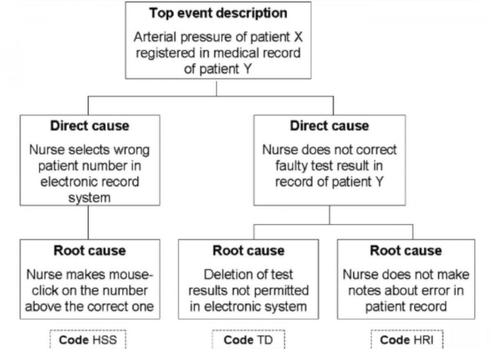

## Learning from incidents

Incidents are a chance to learn something and thereby prevent new incidents. In the medical world, PRISMA is a well-known method (and according to [Oxford](http://intqhc.oxfordjournals.org/content/21/4/292) a reliable one) to analyse them. Below is an example of the visualisation of a case.

## Also useful in tech

This method can also be useful within tech companies.

## Chronological reconstruction

An investigation team makes a chronological reconstruction, based on the available data and interviews.

## Cause tree

The team records the logical relation between the incident and the root causes in a cause tree. The root causes can directly serve as input for recommendations for improvement.

## Finding patterns

With the help of a classification model, the results of multiple analyses can be used to discover patterns. This makes it possible to substantiate improvements across the whole organisation.