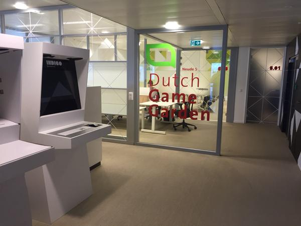

Last week, Erik, Timo, and I once again gave a successful workshop for the startups in the [Dutch Game Garden incubator](https://en.wikipedia.org/wiki/Dutch_Game_Garden).

## Theory that really works

Among other things, we went through a relevant case by Henrik Kniberg, who applied Scrum and Kanban at a game company.