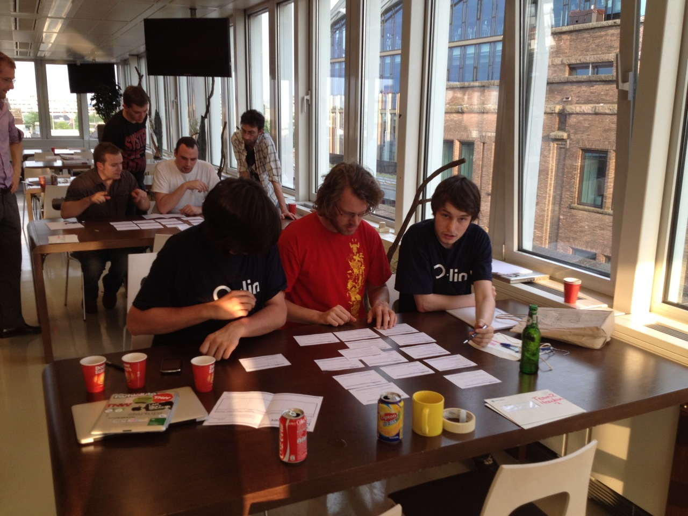
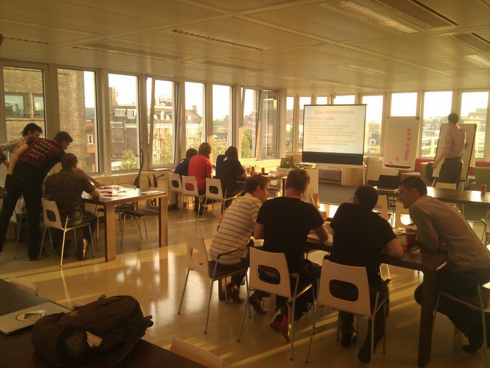

## The workshop

Today, together with Timo Mulder, I gave a Scrum workshop for some very enthusiastic startups like Peerby.

## Theory that really works

We covered all the basics in a short time. By playing several agile games, the participants realized that the theory really works!

## Why startups benefit

Startups often have limited resources and therefore benefit maximally from an agile process.