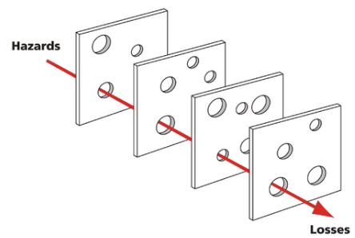

## Related to PRISMA

A while ago I posted an article about the [PRISMA](../prisma-systemic-incident-analysis/) incident analysis model. Related to this subject is the concept of the "Swiss Cheese Model". This model shows why things can still go wrong when there are multiple layers of protection in place.

## When the holes line up

In every layer there are holes, and sometimes these holes line up, resulting in an incident. Also see the Wikipedia [Swiss Cheese Model](https://en.wikipedia.org/wiki/Swiss_cheese_model) page.
