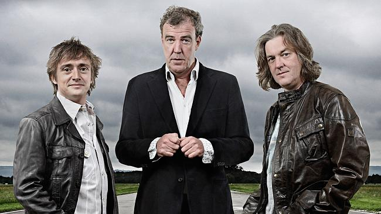
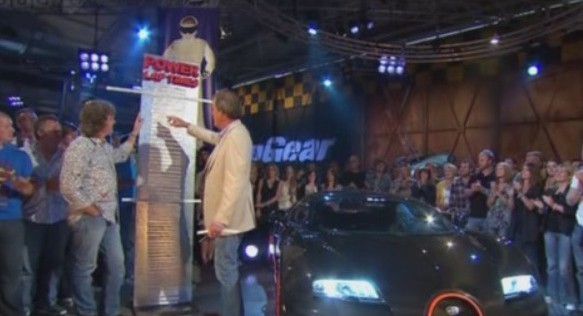
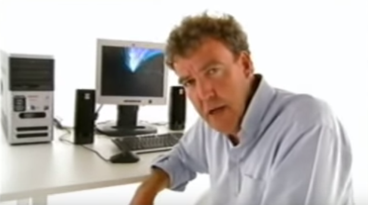

## A physical board beats a digital one

How Top Gear shows that a physical scrum board is more valuable than its digital counterpart.

## Which tool should I use?

A question that is asked very often is: "which tool can I best use to support my Agile process?". My answer is often: a board, pen and paper! But if it really cannot be done otherwise: a board, pen and paper!

Because many agile projects deal with developing software, a team often reaches for software to maintain the scrum artefacts (sprint board, burndown chart and backlog). The problem with this solution is unfortunately that it does not offer the best communication and interaction. You also often see that the tool gets more attention than the artefact it is meant for (tool selection, tool installation, upgrades, granting permissions, creating users, backups, ..)

## Individuals and interactions

The Agile Manifesto pays attention to this subject for a reason:

> Individuals and interactions over processes and tools

## A good example: Top Gear

Today I thought of a nice example of a well-working application of a board, pen and paper: Top Gear!

On a board in Top Gear, the list of lap times set by famous people is kept. This always comes with a lot of fuss and is an impressive spectacle.

## Communication around the board

The communication around the board is optimal; it offers a stage to express thoughts and emotions and to change an order quickly. Even the handwriting contains a message; small letters, big letters, thick letters: the "state of mind" of Jeremy is captured in it and can also be read back. The result of all this is that for many lap times I still remember what happened when I see the board. The note in question and the content behind it are stored very clearly in my brain.

## Try that with a computer

Try getting this result with a computer program and a screen! How would Top Gear look if Jeremy Clarkson worked with the computer above?